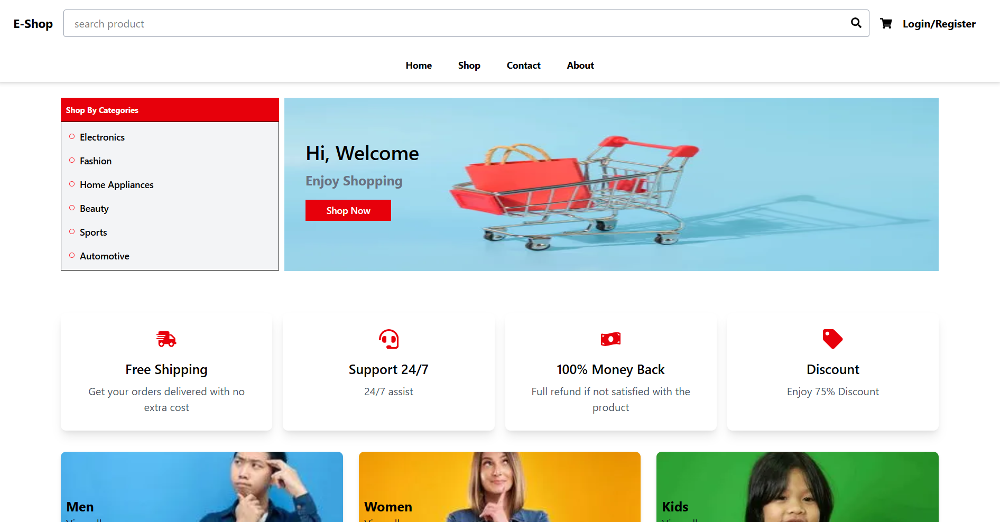
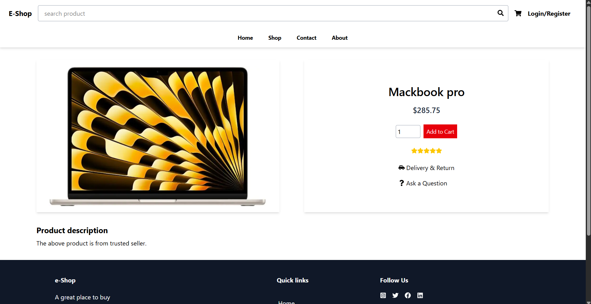
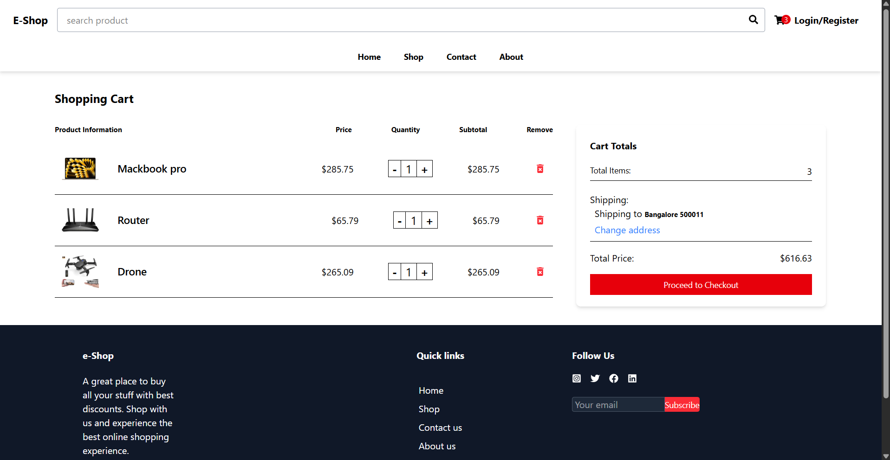

# 🛍️ One Silk E‑Commerce Store

A sleek, responsive e‑commerce storefront built with Next.js and styled with Tailwind CSS. Features include product browsing, filters, product detail views, and a clean UI.

---

## 🚀 Live Demo

Check it out here: https://e-commerce-store-one-silk.vercel.app/

---

## 📸 Preview





---

## 🧩 Features

- 🏪 Clean homepage with Hero banner and featured items
- 📦 Grid layout for product browsing
- 🔎 Product filter and sort (pricing, categories)
- 🛍️ Product detail page with images and descriptions
- 💡 Mobile-first and fully responsive via Tailwind CSS
- 🚀 Built with Next.js and Vercel for fast dev + build tools

---

## 🛠️ Tech Stack


| Tech            | Purpose                       |
|-----------------|-------------------------------|
| NextJS          | UI framework                  |
| Tailwind CSS    | Styling                       |
| Vite            | Fast dev + build tool         |
| Vercel          | Hosting and deployment        |

## 📥 Getting Started Locally

1. **Clone the repo**
    ```bash
    git clone https://github.com/HariKishore7/E-Commerce-Store
    cd E-Commerce-Store
    ```

2. **Install dependencies**
    ```bash
    npm install
    ```

3. **Run dev server**
    ```bash
    npm run dev
    ```
    Visit `http://localhost:5173`

4. **Build for production**
    ```bash
    npm run build
    npm start
    ```
    Visit `http://localhost:4173`

---